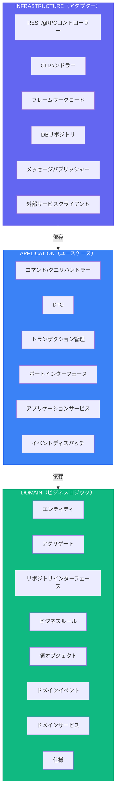

# クイックリファレンスチートシート

> 出典一覧は [SKILL.md](../SKILL.md#参照ドキュメント) を参照。

## レイヤーサマリー



*依存は内側を向く*

---

## クイック判断ツリー

### 「このコードはどこに置く？」

```
ビジネスルールや制約か？
├── はい → Domainレイヤー
└── いいえ ↓

ユースケースをオーケストレーションしているか？
├── はい → Applicationレイヤー
└── いいえ ↓

外部システム（DB、API、UI）を扱っているか？
├── はい → Infrastructureレイヤー
└── いいえ → 再考; おそらくDomain
```

### 「エンティティか値オブジェクトか？」

```
永続する一意のIDを持つか？
├── はい → エンティティ
└── いいえ ↓

属性のみで定義されるか？
├── はい → 値オブジェクト
└── いいえ → おそらくエンティティ
```

### 「アグリゲート境界は？」

```
これらのオブジェクトはアトミックに一緒に変更される必要があるか？
├── はい → 同じアグリゲート
└── いいえ ↓

一方が他方なしに存在できるか？
├── はい → 別アグリゲート（IDで参照）
└── いいえ → おそらく同じアグリゲート
```

### 「ドメインサービスかエンティティメソッドか？」

```
1つのエンティティに自然に属するか？
├── はい → エンティティメソッド
└── いいえ ↓

複数のアグリゲートが必要か？
├── はい → ドメインサービス
└── いいえ ↓

ステートレスなビジネスロジックか？
├── はい → ドメインサービス
└── いいえ → 配置を再考
```

---

## 共通パターンクイックリファレンス

### 値オブジェクトテンプレート

```typescript
export class Money {
  private constructor(private readonly _amount: number, private readonly _currency: string) {}

  static create(amount: number, currency: string): Money {
    if (amount < 0) throw new Error('Negative');
    return new Money(amount, currency);
  }

  add(other: Money): Money {
    return Money.create(this._amount + other._amount, this._currency);
  }

  get amount(): number { return this._amount; }
  get currency(): string { return this._currency; }

  equals(other: Money): boolean {
    return this._amount === other._amount && this._currency === other._currency;
  }
}
```

### アグリゲートルートテンプレート

```typescript
export class Order extends AggregateRoot<OrderId> {
  private _items: OrderItem[] = [];
  private _status: OrderStatus;

  static create(customerId: CustomerId): Order {
    const order = new Order(OrderId.generate(), customerId);
    order.addDomainEvent(new OrderCreated(order.id, customerId));
    return order;
  }

  addItem(productId: ProductId, quantity: Quantity, price: Money): void {
    this.assertCanModify();
    this._items.push(OrderItem.create(productId, quantity, price));
  }

  confirm(): void {
    this.assertCanModify();
    if (this._items.length === 0) throw new EmptyOrderError();
    this._status = OrderStatus.Confirmed;
    this.addDomainEvent(new OrderConfirmed(this.id, this.total));
  }

  private assertCanModify(): void {
    if (this._status === OrderStatus.Cancelled) throw new InvalidOrderStateError('Order is cancelled');
  }
}
```

### リポジトリインターフェーステンプレート

```typescript
export interface IOrderRepository {
  findById(id: OrderId): Promise<Order | null>;
  save(order: Order): Promise<void>;
  delete(order: Order): Promise<void>;
}
```

### ユースケースハンドラーテンプレート

```typescript
export class PlaceOrderHandler {
  constructor(
    private readonly orderRepo: IOrderRepository,
    private readonly productRepo: IProductRepository,
    private readonly eventPublisher: IEventPublisher,
  ) {}

  async execute(command: PlaceOrderCommand): Promise<OrderId> {
    const order = Order.create(CustomerId.from(command.customerId));
    for (const item of command.items) {
      const product = await this.productRepo.findById(item.productId);
      order.addItem(product.id, Quantity.create(item.quantity), product.price);
    }
    await this.orderRepo.save(order);
    await this.eventPublisher.publishAll(order.domainEvents);
    return order.id;
  }
}
```

---

## ポート命名規則

| 種類 | パターン | 例 |
|------|---------|-----|
| ドライバーポート | `I{Action}UseCase` | `IPlaceOrderUseCase`, `IGetOrderUseCase` |
| ドリブンポート | `I{Resource}Repository` | `IOrderRepository`, `IProductRepository` |
| ドリブンポート | `I{Action}Service` | `IPaymentService`, `INotificationService` |
| ドリブンポート | `I{Resource}Gateway` | `IPaymentGateway`, `IShippingGateway` |

---

## 共通アンチパターン

| アンチパターン | 問題 | 解決策 |
|--------------|------|--------|
| 貧血ドメイン | エンティティがただのデータ袋 | 振る舞いをエンティティに入れる |
| テーブルごとのリポジトリ | DBテーブルごとに1リポジトリ | アグリゲートごとに1リポジトリ |
| 肥大化ユースケース | ハンドラーにビジネスロジック | ドメインに移動 |
| 漏洩する抽象化 | ドメインがORMに依存 | ドメインを純粋に保つ |
| 巨大アグリゲート | 1つの巨大アグリゲート | 小さく分割 |
| アグリゲート横断TX | 1TXで複数を変更 | ドメインイベントを使用 |
| レイヤースキップ | コントローラー→リポジトリ直接 | Applicationレイヤーを経由 |
| 早すぎるCQRS | 早期に複雑さを追加 | シンプルに始め、進化 |
| イベント増殖 | 細粒度すぎるイベント | コンテキスト境界のシグナルかも |

---

## 依存ルールマトリクス

|  | Domain | Application | Infrastructure |
|--|--------|-------------|----------------|
| **Domain** | ✅ | ❌ | ❌ |
| **Application** | ✅ | ✅ | ❌ |
| **Infrastructure** | ✅ | ✅ | ✅ |

✅ = 依存可能 / ❌ = 依存不可

---

## 使うべき時 / スキップすべき時

### Clean + DDD + Hexagonalを使うべき時:

- ✅ 多くのルールを持つ複雑なビジネスドメイン
- ✅ 長期運用システム（年単位の保守）
- ✅ 大チーム（5人以上）
- ✅ インフラ交換の必要性（DB、ブローカー等）
- ✅ 高テストカバレッジが必要
- ✅ 複数エントリポイント（API、CLI、イベント、スケジュールジョブ）

### スキップすべき時:

- ❌ シンプルなCRUDアプリケーション（ほとんどのアプリ）
- ❌ プロトタイプ / MVP / 使い捨てコード
- ❌ 小チーム（1-2人）
- ❌ 短期プロジェクト
- ❌ 些細なビジネスロジック

### 複雑さのはしご（シンプルに始める）

```
レベル1: シンプルなレイヤード（Controller → Service → Repository）
   ↓ ビジネスルールが複雑になったら
レベル2: ドメインモデル（振る舞いを持つエンティティ）
   ↓ 複数エントリポイントが必要になったら
レベル3: ヘキサゴナル（ポート＆アダプター）
   ↓ 読み取り/書き込みパターンが大きく乖離したら
レベル4: CQRS（読み取り/書き込みモデルの分離）
   ↓ 完全な監査証跡/時間的クエリが必要になったら
レベル5: イベントソーシング（イベントを保存、状態を導出）
```

**レベルを飛ばさない。** 各レベルは複雑さを追加する。現在のレベルが不十分であることを証明してから上に移動。

---

## リソース

### 書籍
- Clean Architecture (Robert C. Martin, 2017)
- Domain-Driven Design (Eric Evans, 2003)
- Implementing Domain-Driven Design (Vaughn Vernon, 2013)
- Hexagonal Architecture Explained (Alistair Cockburn, 2024)
- Get Your Hands Dirty on Clean Architecture (Tom Hombergs, 2019)

### リファレンス実装
- Go: [bxcodec/go-clean-arch](https://github.com/bxcodec/go-clean-arch)
- Rust: [flosse/clean-architecture-with-rust](https://github.com/flosse/clean-architecture-with-rust)
- Python: [cdddg/py-clean-arch](https://github.com/cdddg/py-clean-arch)
- TypeScript: [jbuget/nodejs-clean-architecture-app](https://github.com/jbuget/nodejs-clean-architecture-app)
- .NET: [jasontaylordev/CleanArchitecture](https://github.com/jasontaylordev/CleanArchitecture)
- Java: [thombergs/buckpal](https://github.com/thombergs/buckpal)
