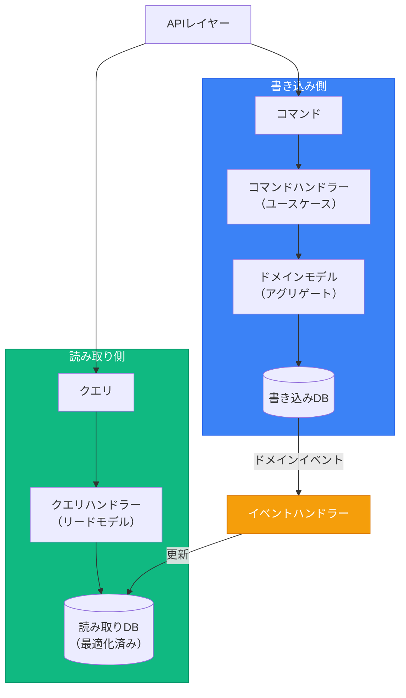

# CQRS＆ドメインイベント

> 出典:
> - [CQRS](https://martinfowler.com/bliki/CQRS.html) — Martin Fowler
> - [Event Sourcing](https://martinfowler.com/eaaDev/EventSourcing.html) — Martin Fowler
> - [CQRS Pattern](https://learn.microsoft.com/en-us/azure/architecture/patterns/cqrs) — Microsoft Azure
> - [Transactional Outbox](https://microservices.io/patterns/data/transactional-outbox.html) — microservices.io
> - [Domain Events – Salvation](https://udidahan.com/2009/06/14/domain-events-salvation/) — Udi Dahan
> - [Strengthening Your Domain: Domain Events](https://lostechies.com/jimmybogard/2010/04/08/strengthening-your-domain-domain-events/) — Jimmy Bogard
> - [Domain Events: Design and Implementation](https://learn.microsoft.com/en-us/dotnet/architecture/microservices/microservice-ddd-cqrs-patterns/domain-events-design-implementation) — Microsoft

## CQRS概要

**コマンドクエリ責務分離**は、読み取りと書き込み操作を異なるモデルに分離する。



---

## コマンド vs クエリ

### コマンド（書き込み側）

コマンドは状態変更の意図を表す。データを**変更する**。

```typescript
export interface PlaceOrderCommand {
  type: 'PlaceOrder';
  customerId: string;
  items: Array<{ productId: string; quantity: number }>;
}

export class PlaceOrderHandler {
  async handle(command: PlaceOrderCommand): Promise<OrderId> {
    const order = Order.create(CustomerId.from(command.customerId));
    for (const item of command.items) {
      const product = await this.productRepo.findById(item.productId);
      order.addItem(product.id, item.quantity, product.price);
    }
    await this.orderRepo.save(order);
    await this.eventPublisher.publishAll(order.domainEvents);
    return order.id;
  }
}
```

### クエリ（読み取り側）

クエリは副作用なしにデータを取得する。状態を**絶対に変更しない**。

```typescript
export interface GetOrderQuery {
  orderId: string;
}

export class GetOrderHandler {
  constructor(private readonly readDb: IOrderReadModel) {}

  async handle(query: GetOrderQuery): Promise<OrderDTO | null> {
    return this.readDb.findById(query.orderId);
  }
}
```

---

## リードモデル（プロジェクション）

クエリに最適化されたデータベース構造。パフォーマンスのためにデータを非正規化可能。

```
interface IOrderReadModel:
    findById(orderId: string) -> OrderDTO | null
    findByCustomer(customerId, status?, page?, pageSize?) -> PaginatedResult<OrderDTO>
    search(criteria: OrderSearchCriteria) -> List<OrderDTO>
```

書き込みと読み取りのデータベースを分離（オプション）: 書き込みはトランザクション用に正規化、読み取りはクエリ用に非正規化。

---

## ドメインイベント

ドメインで何かが起きたことの通知。用途:
- リードモデルの更新
- アグリゲート間通信
- 他の境界づけられたコンテキストとの統合

### イベント構造

```typescript
export abstract class DomainEvent {
  readonly eventId: string;
  readonly occurredAt: Date;
  readonly aggregateId: string;
  abstract readonly eventType: string;

  constructor(aggregateId: string) {
    this.eventId = crypto.randomUUID();
    this.occurredAt = new Date();
    this.aggregateId = aggregateId;
  }

  abstract toPayload(): Record<string, unknown>;
}

export class OrderCreated extends DomainEvent {
  readonly eventType = 'order.created';
  constructor(readonly orderId: OrderId, readonly customerId: CustomerId) {
    super(orderId.value);
  }
  toPayload() {
    return { orderId: this.orderId.value, customerId: this.customerId.value };
  }
}
```

### イベントハンドラー

```
class OrderCreatedHandler:
    db: Database

    handle(event: OrderCreated):
        db.ordersRead.insert({
            id: event.orderId.value,
            customerId: event.customerId.value,
            status: "draft",
            createdAt: event.occurredAt
        })
```

---

## ドメインイベント vs 統合イベント

### ドメインイベント

- 境界づけられたコンテキスト内に留まる
- 細粒度、低レベル
- 内部プロセスをトリガー
- ドメイン言語で命名

### 統合イベント

- 境界づけられたコンテキストを横断
- 粗粒度
- メッセージブローカーに発行
- バージョン管理されたスキーマ

```typescript
interface OrderConfirmedIntegrationEvent {
  eventType: 'sales.order.confirmed';
  eventId: string;
  version: '1.0';
  occurredAt: string;
  payload: {
    orderId: string;
    customerId: string;
    total: { amount: number; currency: string };
    items: Array<{ productId: string; quantity: number; unitPrice: number }>;
  };
}
```

---

## イベントディスパッチャーパターン

```typescript
export class EventDispatcher {
  private handlers: Map<string, IEventHandler<any>[]> = new Map();

  register<T extends DomainEvent>(eventType: string, handler: IEventHandler<T>): void {
    const existing = this.handlers.get(eventType) ?? [];
    existing.push(handler);
    this.handlers.set(eventType, existing);
  }

  async dispatch(event: DomainEvent): Promise<void> {
    const handlers = this.handlers.get(event.eventType) ?? [];
    await Promise.all(handlers.map(h => h.handle(event)));
  }
}
```

---

## Outboxパターン

イベントの確実な発行を保証（exactly-onceセマンティクス）。

```
class PlaceOrderHandler:
    handle(command: PlaceOrderCommand) -> OrderId:
        order = Order.create(CustomerId.from(command.customerId))

        db.transaction((tx) => {
            orderRepo.save(order, tx)
            for event in order.domainEvents:
                outbox.save(event, tx)  // 同一トランザクションで保存
        })

        return order.id

class OutboxProcessor:
    process():
        messages = outbox.getUnprocessed()
        for message in messages:
            try:
                messageBroker.publish(message.eventType, message.payload)
                outbox.markProcessed(message.id)
            catch error:
                log.error("Outboxメッセージ処理失敗", message.id)
```

---

## CQRSを使うべき時

> **警告:** 「CQRSの使用には非常に慎重であるべき...私が遭遇したケースの大半はそれほど良くなかった。」— Martin Fowler

CQRSは大きな複雑さを追加する。ほとんどのアプリケーションには不要。

### CQRSを使うべき時:

- 読み取りと書き込みのワークロードが**劇的に**異なるスケーリング要件を持つ
- ドメインモデルにうまくマッピングできない複雑なクエリ
- 読み取り側と書き込み側で異なるチームが作業
- イベントソーシングを使用（CQRSはESと自然にペアリング）
- シンプルなアプローチが不十分であることを証明済み

### CQRSをスキップすべき時:

- シンプルなCRUDアプリケーション（ほとんどのアプリ）
- 読み取り/書き込みパターンが類似
- 小チーム、シンプルなドメイン
- シンプルなレポーティングDBをまだ試していない
- 「念のため」で追加

**CQRSは特定の境界づけられたコンテキストに適用し、システム全体には絶対に適用しない。**

### 簡略化CQRS（ここから始める）

シンプルに始める — 同じDB、異なるクエリパス:

```typescript
class OrderService {
  async placeOrder(cmd: PlaceOrderCommand): Promise<OrderId> {
    const order = Order.create(...);
    await this.orderRepo.save(order);
    return order.id;
  }

  async getOrder(id: string): Promise<OrderDTO | null> {
    return this.readModel.findById(id);
  }
}
```

必要な時にのみ別DBに進化させる。

---

## イベントソーシング: 重要な考慮事項

> **警告:** 「元々イベントソーシング用に設計されていないシステムに後から追加するのは極めて困難。」— Martin Fowler

### イベントソーシングが適する場合

- 完全な監査証跡がビジネス要件
- 任意の時点で状態を再構築する必要がある
- ドメインが本質的にイベント駆動（金融取引、ワークフロー）
- デバッグに「どうやってここに至ったか」の理解が必要

### イベントソーシングを避けるべき場合

- 監査要件のないシンプルなCRUD
- イベント駆動パターンに不慣れなチーム
- 既存システムへの後付け
- 時間的クエリの明確なビジネスニーズがない

---

## Sagaパターン（アグリゲート横断ワークフロー）

複数のアグリゲートにまたがるワークフローには、生のドメインイベントで調整するのではなくSagaを使用。

```
Saga: PlaceOrderSaga
├── ステップ1: 在庫予約（Inventoryアグリゲート）
├── ステップ2: 決済処理（Paymentアグリゲート）
├── ステップ3: 注文確認（Orderアグリゲート）
└── いずれかのステップが失敗した場合の補償アクション
```

**Sagaの種類:**
- **コレオグラフィ:** 各サービスがイベントをリッスン/発行（シンプル、追跡が困難）
- **オーケストレーション:** 中央コーディネーターがステップを管理（明示的、デバッグが容易）

---

## 冪等コンシューマーパターン

**信頼性の高いイベント処理に必須。** メッセージは複数回配信される可能性がある。

```
class OrderConfirmedHandler:
    processedIds: Set<string>

    handle(event: OrderConfirmed):
        if event.eventId in processedIds:
            return  // 既に処理済み

        doWork(event)
        processedIds.add(event.eventId)
```

**実装オプション:**
- 処理済みメッセージIDをDBに保存
- メッセージブローカーの重複排除機能を使用
- ハンドラーを自然に冪等になるよう設計
