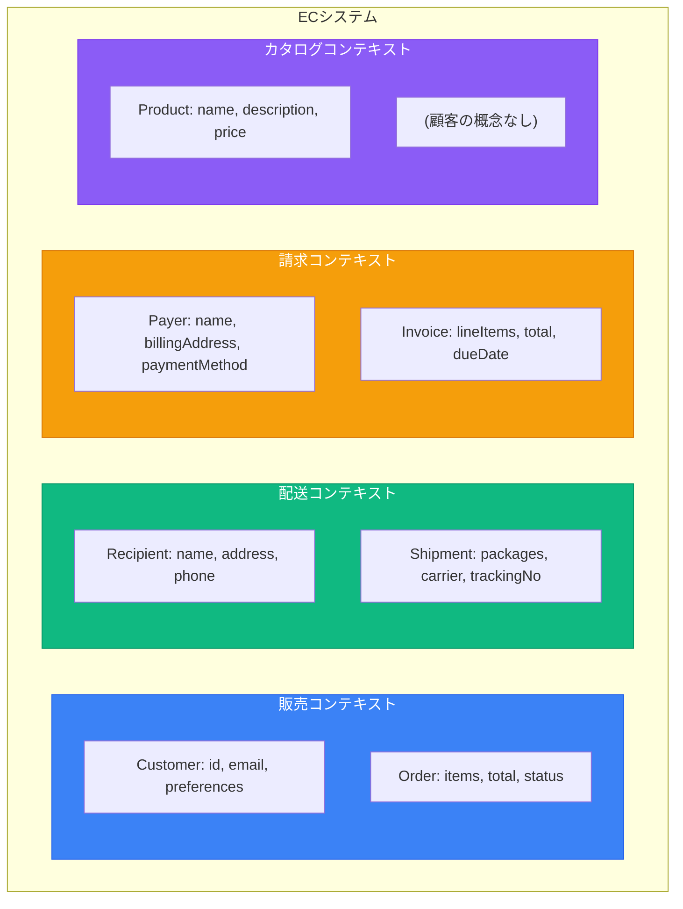
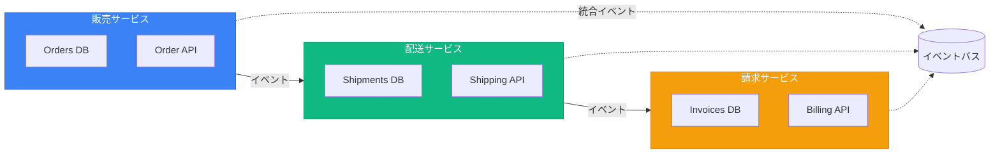
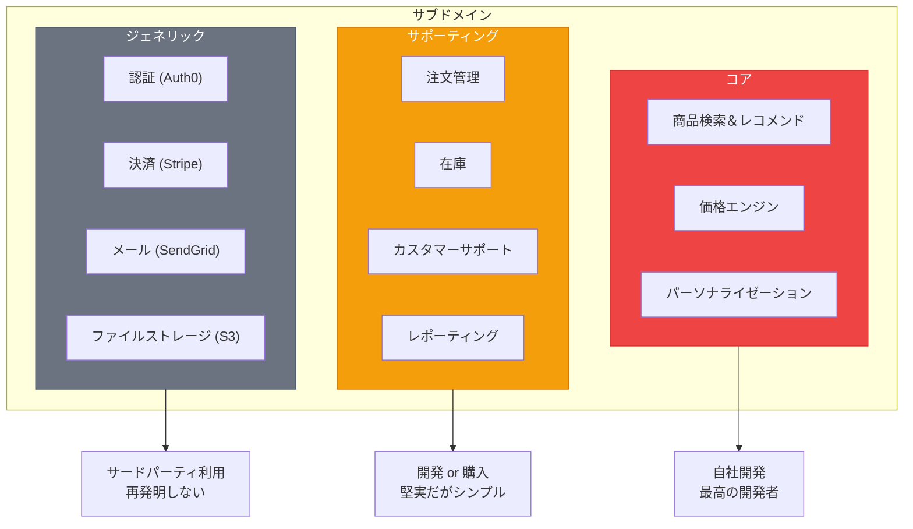
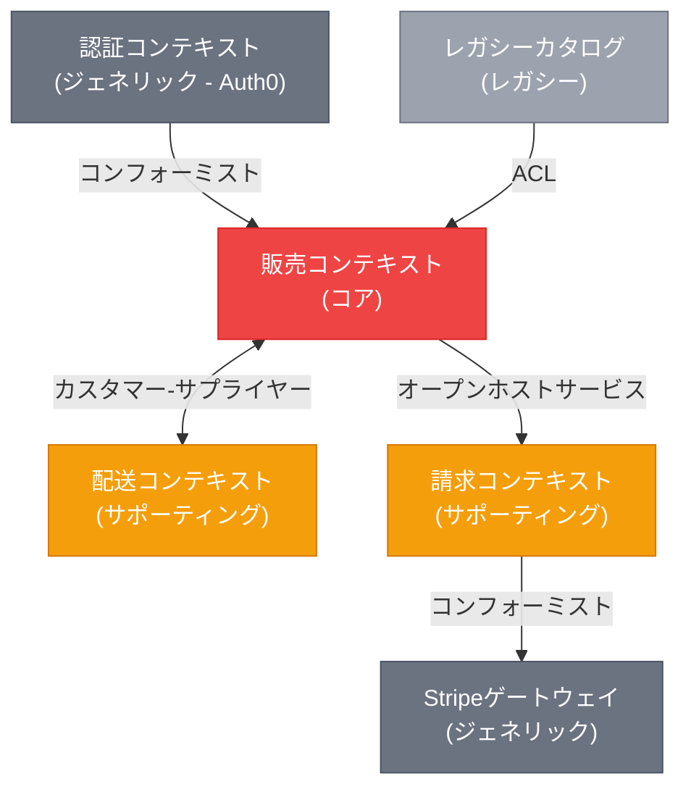

# DDD戦略パターン

> 出典:
> - [Domain-Driven Design: The Blue Book](https://www.domainlanguage.com/ddd/blue-book/) — Eric Evans (2003)
> - [DDD Resources](https://www.domainlanguage.com/ddd/) — Domain Language (Eric Evans)
> - [Bounded Context](https://martinfowler.com/bliki/BoundedContext.html) — Martin Fowler
> - [Domain Driven Design](https://martinfowler.com/bliki/DomainDrivenDesign.html) — Martin Fowler
> - [Anti-Corruption Layer](https://docs.aws.amazon.com/prescriptive-guidance/latest/cloud-design-patterns/acl.html) — AWS
> - [Domain Analysis for Microservices](https://learn.microsoft.com/en-us/azure/architecture/microservices/model/domain-analysis) — Microsoft

## 概要

戦略的DDDパターンは、大規模システムを明確な境界を持つ管理可能な部分に分解する。答えるべき問い: **「複雑なドメインをどう分割するか？」**

**DDDは本質的に協調的。** 以下のパターンは、ドメインエキスパートとの対話、ホワイトボーディング、モデリングセッションから生まれる — コーディングだけからではない。

---

## ドメイン発見テクニック

### イベントストーミング

ドメインイベント、アグリゲート、境界づけられたコンテキストを発見するワークショップ手法。

```
オレンジ付箋: ドメインイベント（過去形: "OrderPlaced"）
青付箋: コマンド（命令形: "Place Order"）
黄付箋: アグリゲート（名詞: "Order"）
ピンク付箋: 外部システム / ポリシー
紫付箋: 問題 / 質問
```

**ワークショップの流れ:**
1. **カオス的探索** — 全員が知っているイベントを追加
2. **タイムライン整理** — イベントを時系列に配置
3. **アグリゲート特定** — 関連イベントをグループ化
4. **境界発見** — 言語が変わる場所 = 境界づけられたコンテキストの境界
5. **問題の表面化** — 不明確な領域をフォローアップ用にマーク

### コンテキストマッピングワークショップ

既存システムの場合、境界づけられたコンテキスト間の現在のインタラクションをマッピング:
1. 全システム/サービスをリスト
2. 各チームの所有権を特定
3. 関係を描画（上流/下流）
4. 関係タイプにラベル付け（ACL、Conformist等）
5. 現在の統合の問題点を特定

---

## ユビキタス言語

DDDの基盤。開発者とドメインエキスパートの間で共有される語彙で、以下に現れる:
- コード（クラス名、メソッド名）
- ドキュメント
- 会話
- UIラベル

### 原則

1. **境界づけられたコンテキストごとに1つの言語** - 異なるコンテキストでは同じ単語が異なる意味を持つ場合がある
2. **コードは言語を反映** - `Order.confirm()` であって `Order.setStatus("confirmed")` ではない
3. **共に進化** - 言語が変わればコードも変わる

### 例

```
❌ 技術的な言語:
   「注文エンティティのステータスフィールドを2に設定してレコードを挿入」

✅ ユビキタス言語:
   「注文を確認し、確認されたことを記録する」
```

```typescript
// ❌ 技術的、ユビキタスでない
class Order {
  setStatus(status: number): void { this.status = status; }
}

// ✅ ユビキタス言語
class Order {
  confirm(): void {
    if (this.status !== OrderStatus.Pending) {
      throw new OrderCannotBeConfirmedException(this.id);
    }
    this.status = OrderStatus.Confirmed;
    this.confirmedAt = new Date();
    this.addDomainEvent(new OrderConfirmed(this.id));
  }
}
```

---

## 境界づけられたコンテキスト

特定のドメインモデルが適用される**意味的境界**。境界づけられたコンテキスト内では、用語は正確で曖昧さのない意味を持つ。

> **重要な洞察:** 部門間での多義性（同じ単語、異なる意味）は自然であり、問題ではない。異なるコンテキストで同じ用語が異なる意味を持つことは想定内 — 「支配的な境界要因は人間の文化と言語の変異である」— Martin Fowler

### 主要概念

- 各境界づけられたコンテキストは**独自のユビキタス言語**を持つ
- 各境界づけられたコンテキストは**独自のモデル**を持つ
- 同じ現実世界の概念が異なるコンテキストで**異なる表現**を持つ場合がある

### 例: ECシステム



**「Customer」の意味はコンテキストで異なる:**
- **販売**: メール、好み、注文履歴
- **配送**: 配送先住所、電話番号
- **請求**: 支払い方法、請求先住所

### 境界づけられたコンテキスト = マイクロサービス境界

マイクロサービスでは、各境界づけられたコンテキストは通常別のサービスになる:



---

## サブドメイン

ビジネス専門知識の領域。サブドメインは**発見する**ものであり、設計するものではない。

### 種類

| 種類 | 説明 | 投資 | 例 |
|------|------|------|-----|
| **コア** | 競争優位性 | 高 | 商品レコメンドエンジン |
| **サポーティング** | 必要だがユニークではない | 中 | 注文管理 |
| **ジェネリック** | コモディティ、購入/外注 | 低 | メール送信、決済 |

### 特定のための質問

1. 競合他社と何が違うか？ → **コア**
2. 必要だが専門ではないものは？ → **サポーティング**
3. 誰もが同じ方法で必要とするものは？ → **ジェネリック**

### 例: EC



---

## コンテキストマッピング

境界づけられたコンテキスト間の関係を記述する。

### 関係パターン

#### パートナーシップ
2つのコンテキストが共に成功または失敗する。チームは密に連携。

#### 共有カーネル
2つのコンテキストがドメインモデルのサブセットを共有。

**警告:** 共有カーネルは結合を生む。控えめに使用。

#### カスタマー-サプライヤー
上流コンテキストが下流の必要なものを提供。

#### コンフォーミスト
下流が交渉力なしに上流のモデルに従う。

**例:** サードパーティAPI（Stripe、AWS）との統合。

#### 腐敗防止層（ACL）
外部モデルから自分のモデルを保護する翻訳レイヤー。

**使用場面:**
- レガシーシステムとの統合
- サードパーティAPIとの統合
- 外部モデルが乱雑または設計が悪い場合

```typescript
// 腐敗防止層の例
// infrastructure/external/stripe/stripe_payment_acl.ts

import Stripe from 'stripe';
import { Payment, PaymentStatus } from '@/domain/payment/payment';
import { Money } from '@/domain/shared/money';

export class StripePaymentACL {
  constructor(private readonly stripe: Stripe) {}

  async createPayment(payment: Payment): Promise<string> {
    const paymentIntent = await this.stripe.paymentIntents.create({
      amount: payment.amount.cents,
      currency: payment.amount.currency.toLowerCase(),
      metadata: {
        orderId: payment.orderId.value,
        customerId: payment.customerId.value,
      },
    });

    return paymentIntent.id;
  }

  translateStatus(stripeStatus: string): PaymentStatus {
    const mapping: Record<string, PaymentStatus> = {
      'requires_payment_method': PaymentStatus.Pending,
      'requires_confirmation': PaymentStatus.Pending,
      'requires_action': PaymentStatus.Pending,
      'processing': PaymentStatus.Processing,
      'succeeded': PaymentStatus.Completed,
      'canceled': PaymentStatus.Cancelled,
      'requires_capture': PaymentStatus.Authorized,
    };

    return mapping[stripeStatus] ?? PaymentStatus.Unknown;
  }

  translateWebhook(event: Stripe.Event): DomainEvent | null {
    switch (event.type) {
      case 'payment_intent.succeeded':
        const intent = event.data.object as Stripe.PaymentIntent;
        return new PaymentCompleted(
          PaymentId.from(intent.metadata.orderId),
          Money.fromCents(intent.amount, intent.currency.toUpperCase())
        );
      case 'payment_intent.payment_failed':
        return null;
      default:
        return null;
    }
  }
}
```

#### オープンホストサービス / 公開言語
統合のための明確に定義されたプロトコルを公開。

---

## コンテキストマップ図

全ての境界づけられたコンテキストとその関係の視覚的表現:



---

## 統合パターン

### コンテキスト統合のためのドメインイベント

```typescript
interface OrderPlaced {
  eventType: 'sales.order.placed';
  orderId: string;
  customerId: string;
  items: Array<{ productId: string; quantity: number; price: number }>;
  total: number;
  shippingAddress: Address;
  occurredAt: string;
}

class ShippingOrderPlacedHandler {
  async handle(event: OrderPlaced): Promise<void> {
    const shipment = Shipment.create({
      orderId: ShipmentOrderId.from(event.orderId),
      recipient: Recipient.fromAddress(event.shippingAddress),
      packages: this.calculatePackages(event.items),
    });

    await this.shipmentRepository.save(shipment);
  }
}

class BillingOrderPlacedHandler {
  async handle(event: OrderPlaced): Promise<void> {
    const invoice = Invoice.create({
      orderId: InvoiceOrderId.from(event.orderId),
      customerId: BillingCustomerId.from(event.customerId),
      lineItems: event.items.map(item => ({
        description: `Product ${item.productId}`,
        quantity: item.quantity,
        unitPrice: Money.fromNumber(item.price),
      })),
      total: Money.fromNumber(event.total),
    });

    await this.invoiceRepository.save(invoice);
  }
}
```

### イベントスキーマレジストリ

統合イベントスキーマの定義とバージョニング:

```json
{
  "$schema": "http://json-schema.org/draft-07/schema#",
  "$id": "https://api.company.com/events/sales/order-placed/v1.json",
  "title": "OrderPlaced",
  "description": "注文が正常に確定された時に発行",
  "type": "object",
  "required": ["eventType", "eventId", "orderId", "occurredAt"],
  "properties": {
    "eventType": { "const": "sales.order.placed" },
    "eventId": { "type": "string", "format": "uuid" },
    "orderId": { "type": "string", "format": "uuid" },
    "customerId": { "type": "string", "format": "uuid" },
    "total": { "type": "number", "minimum": 0 },
    "occurredAt": { "type": "string", "format": "date-time" }
  }
}
```

---

## 戦略設計チェックリスト

- [ ] ドメインエキスパートとユビキタス言語の用語を特定
- [ ] サブドメインをマッピング（コア、サポーティング、ジェネリック）
- [ ] 境界づけられたコンテキストの境界を定義
- [ ] 関係を含むコンテキストマップを文書化
- [ ] 外部システム用の腐敗防止層を設計
- [ ] 統合イベントスキーマを定義
- [ ] 各コンテキストが独自のデータストアを持つことを確認
