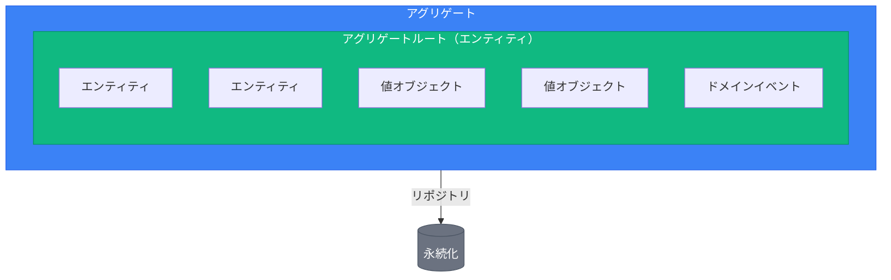
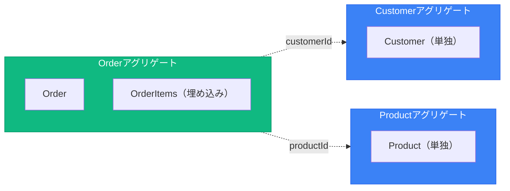
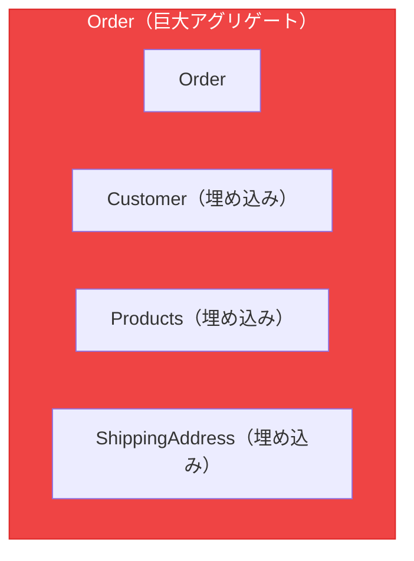

# DDD戦術パターン

> 出典:
> - [Domain-Driven Design: The Blue Book](https://www.domainlanguage.com/ddd/blue-book/) — Eric Evans (2003)
> - [Implementing Domain-Driven Design](https://openlibrary.org/works/OL17392277W) — Vaughn Vernon (2013)
> - [Effective Aggregate Design](https://www.dddcommunity.org/library/vernon_2011/) — Vaughn Vernon
> - [Repository Pattern](https://martinfowler.com/eaaCatalog/repository.html) — Martin Fowler (PoEAA)

## ビルディングブロック概要



---

## エンティティ

時間を通じて持続する**アイデンティティ**を持つオブジェクト。属性値に関係なく、同じアイデンティティを持つ2つのエンティティは等しい。

### 特徴

- 一意の識別子を持つ
- ライフサイクルを通じてアイデンティティが持続
- 属性は変更可能だが、同じエンティティのまま
- 振る舞いを含む（データだけではない）

### パターン

```
abstract class Entity<ID>:
    id: ID

    equals(other: Entity<ID>) -> bool:
        return this.id == other.id

class OrderItem extends Entity<OrderItemId>:
    productId: ProductId
    quantity: Quantity
    unitPrice: Money

    static create(productId, quantity, unitPrice) -> OrderItem:
        return new OrderItem(
            id: OrderItemId.generate(),
            productId: productId,
            quantity: quantity,
            unitPrice: unitPrice
        )

    increaseQuantity(amount: int):
        this.quantity = this.quantity.add(amount)

    subtotal() -> Money:
        return this.unitPrice.multiply(this.quantity.value)
```

---

## 値オブジェクト

アイデンティティではなく**属性**で定義されるオブジェクト。全属性が等しい2つの値オブジェクトは等しい。

### 特徴

- 不変（セッターなし）
- アイデンティティなし
- 値による等価性（全属性）
- 自己検証
- 副作用のないメソッド

### 一般的な値オブジェクト

| 値オブジェクト | 属性 | バリデーション |
|--------------|------|---------------|
| Money | amount, currency | amount >= 0 |
| Email | address | 有効なメール形式 |
| Address | street, city, zip, country | 必須フィールド |
| DateRange | start, end | start <= end |
| Quantity | value | value > 0 |

### パターン

```
abstract class ValueObject<Props>:
    props: Props

    equals(other: ValueObject<Props>) -> bool:
        return deepEqual(this.props, other.props)

class Money extends ValueObject<{amount, currency}>:

    static create(amount, currency) -> Money:
        guard: amount >= 0
        guard: currency in SUPPORTED_CURRENCIES
        return new Money({amount, currency})

    static zero(currency = "USD") -> Money:
        return Money.create(0, currency)

    add(other: Money) -> Money:
        guard: this.currency == other.currency
        return Money.create(this.amount + other.amount, this.currency)

    subtract(other: Money) -> Money:
        guard: this.currency == other.currency
        return Money.create(this.amount - other.amount, this.currency)

    multiply(factor: number) -> Money:
        return Money.create(this.amount * factor, this.currency)

class Email extends ValueObject<{value}>:

    static create(email: string) -> Email:
        normalized = email.lowercase().trim()
        guard: isValidEmailFormat(normalized)
        return new Email({value: normalized})

    domain() -> string:
        return this.value.split("@")[1]

class OrderId extends ValueObject<{value}>:

    static generate() -> OrderId:
        return new OrderId({value: generateUUID()})

    static from(value: string) -> OrderId:
        guard: value is not empty
        return new OrderId({value})
```

---

## アグリゲート

データ変更の単一ユニットとして扱われるエンティティと値オブジェクトのクラスタ。**整合性境界**を持つ。

### ルール

1. **1つのアグリゲートルート** - 全変更の単一エントリポイント
2. **IDのみで参照** - アグリゲートは他をアイデンティティで参照、直接オブジェクト参照は禁止
3. **トランザクション境界** - トランザクションごとに1アグリゲート（アグリゲート間は結果整合性）
4. **境界内の不変条件** - アグリゲートは自身の整合性を保証
5. **小さなアグリゲート** - 大きいより小さいを優先

### アグリゲートサイジングのヒューリスティクス

| 指標 | 健全 | 警告 | アクション |
|------|------|------|-----------|
| アグリゲートあたりのエンティティ数 | 1-5 | 6-10 | >10: 分割 |
| コード行数（ルート） | <500 | 500-1000 | >1000: 分割 |
| トランザクションロック時間 | <100ms | 100-500ms | >500ms: 分割 |
| 同時変更の競合 | まれ | 時々 | 頻繁: 分割 |

**問うべき質問:**
- 部分的に結果整合性で良いか？ → 別アグリゲート
- 全部分が一緒に変更されるか？ → 同じアグリゲート
- 独立したライフサイクルがあるか？ → 別アグリゲート

### 設計ガイドライン

**良い例: 小さなアグリゲート**



*IDのみで参照*

**悪い例: 巨大アグリゲート**



*大きすぎ、変更理由が多すぎ、競合問題*

### パターン

```
abstract class AggregateRoot<ID> extends Entity<ID>:
    domainEvents: List<DomainEvent> = []
    version: int = 0

    addDomainEvent(event: DomainEvent):
        this.domainEvents.append(event)

    clearDomainEvents():
        this.domainEvents = []

class Order extends AggregateRoot<OrderId>:
    customerId: CustomerId
    items: List<OrderItem> = []
    status: OrderStatus
    shippingAddress: Address | null
    createdAt: DateTime

    static create(customerId: CustomerId) -> Order:
        order = new Order(
            id: OrderId.generate(),
            customerId: customerId,
            status: DRAFT,
            createdAt: now()
        )
        order.addDomainEvent(OrderCreated{orderId, customerId})
        return order

    static reconstitute(id, customerId, items, status, ...) -> Order:
        order = new Order(...)
        return order

    addItem(productId, quantity, unitPrice):
        guard: status != CANCELLED
        guard: status != SHIPPED
        guard: quantity > 0

        existingItem = this.items.find(i => i.productId == productId)
        if existingItem:
            existingItem.increaseQuantity(quantity)
        else:
            this.items.append(OrderItem.create(productId, quantity, unitPrice))

        this.addDomainEvent(OrderItemAdded{orderId, productId, quantity})

    removeItem(productId):
        guard: status != CANCELLED
        guard: status != SHIPPED
        guard: item exists

        this.items.remove(productId)
        this.addDomainEvent(OrderItemRemoved{orderId, productId})

    confirm():
        guard: status == DRAFT
        guard: items.length > 0
        guard: shippingAddress != null

        this.status = CONFIRMED
        this.addDomainEvent(OrderConfirmed{orderId, total})

    ship(trackingNumber):
        guard: status == CONFIRMED

        this.status = SHIPPED
        this.addDomainEvent(OrderShipped{orderId, trackingNumber})

    cancel(reason: string):
        guard: status not in [SHIPPED, DELIVERED]

        this.status = CANCELLED
        this.addDomainEvent(OrderCancelled{orderId, reason})

    total() -> Money:
        return this.items.reduce((sum, item) => sum.add(item.subtotal()), Money.zero())

    itemCount() -> int:
        return this.items.reduce((sum, item) => sum + item.quantity.value, 0)
```

---

## リポジトリ

アグリゲートへのコレクション風アクセスを提供。永続化を抽象化。

### ルール

1. **アグリゲートごとに1リポジトリ** - エンティティやテーブルごとではない
2. **ドメインインターフェース** - インターフェースはドメインに、実装はインフラに
3. **アグリゲート中心** - アグリゲート全体を保存/読み込み
4. **クエリロジックなし** - 複雑なクエリは別のリードモデルに

### パターン

```
interface OrderRepository:
    findById(id: OrderId) -> Order | null
    findByCustomerId(customerId: CustomerId) -> List<Order>
    save(order: Order)
    delete(order: Order)
    nextId() -> OrderId

interface Repository<T extends AggregateRoot<ID>, ID>:
    findById(id: ID) -> T | null
    save(aggregate: T)
    delete(aggregate: T)
```

### よくある間違い

**間違い: エンティティごとのリポジトリ**

```
interface OrderItemRepository:
    findByOrderId(orderId) -> List<OrderItem>
    save(item: OrderItem)
```

**間違い: リポジトリ内のクエリメソッド**

```
interface OrderRepository:
    findByStatus(status) -> List<Order>
    findByDateRange(start, end)
    countByCustomer(customerId)
```

**正解: アグリゲート中心 + 別リードモデル**

```
interface OrderRepository:
    findById(id: OrderId) -> Order | null
    save(order: Order)

interface OrderReadModel:
    findByStatus(status) -> List<OrderSummaryDTO>
    findByDateRange(start, end) -> List<OrderSummaryDTO>
    countByCustomer(customerId) -> int
```

---

## ドメインイベント

ドメインで起きた重要なことを記録する。

### 特徴

- 不変
- 過去形の命名（`OrderPlaced`、`PlaceOrder` ではない）
- コンシューマーが必要とするデータを含む
- 発生時のタイムスタンプ

### パターン

```
abstract class DomainEvent:
    eventId: string = generateUUID()
    occurredAt: DateTime = now()
    abstract eventType: string

    abstract toPayload() -> Map

class OrderCreated extends DomainEvent:
    eventType = "order.created"
    orderId: OrderId
    customerId: CustomerId

    toPayload():
        return {orderId: orderId.value, customerId: customerId.value}

class OrderConfirmed extends DomainEvent:
    eventType = "order.confirmed"
    orderId: OrderId
    total: Money

    toPayload():
        return {orderId: orderId.value, total: {amount, currency}}

class OrderShipped extends DomainEvent:
    eventType = "order.shipped"
    orderId: OrderId
    trackingNumber: TrackingNumber
```

---

## ドメインサービス

エンティティや値オブジェクトに自然に収まらないステートレスな操作。

### 使用場面

- 操作が複数のアグリゲートに関わる
- 操作が外部情報を必要とする
- 1つのエンティティに属さない重要なビジネスロジック

### パターン

```
interface PricingService:
    calculateDiscount(order: Order, customer: Customer) -> Money

class PricingServiceImpl implements PricingService:

    calculateDiscount(order, customer) -> Money:
        discount = Money.zero()

        if order.itemCount() > 10:
            discount = discount.add(order.total().multiply(0.05))

        if customer.isVIP:
            discount = discount.add(order.total().multiply(0.10))

        maxDiscount = order.total().multiply(0.20)
        return min(discount, maxDiscount)

interface ShippingCostCalculator:
    calculate(items: List<OrderItem>, destination: Address) -> Money

class ShippingCostCalculatorImpl implements ShippingCostCalculator:

    calculate(items, destination) -> Money:
        baseRate = Money.create(5.99, "USD")
        perItemRate = Money.create(1.50, "USD")

        total = baseRate.add(perItemRate.multiply(items.length))

        if destination.country != "US":
            total = total.add(Money.create(15.00, "USD"))

        return total
```

---

## ファクトリ

複雑なアグリゲート/エンティティの生成をカプセル化。

### 使用場面

- 生成ロジックが複雑
- 生成時に不変条件を強制する必要がある
- オブジェクトグラフを生成する必要がある

### パターン

```
interface OrderFactory:
    createFromCart(cart: Cart, customer: Customer) -> Order

class OrderFactoryImpl implements OrderFactory:
    pricingService: PricingService

    createFromCart(cart, customer) -> Order:
        guard: not cart.isEmpty

        order = Order.create(customer.id)

        for cartItem in cart.items:
            order.addItem(
                cartItem.productId,
                Quantity.create(cartItem.quantity),
                cartItem.unitPrice
            )

        if customer.defaultAddress:
            order.setShippingAddress(customer.defaultAddress)

        return order
```

---

## 仕様パターン

クエリやバリデーションのビジネスルールをカプセル化。

```
interface Specification<T>:
    isSatisfiedBy(candidate: T) -> bool
    and(other: Specification<T>) -> Specification<T>
    or(other: Specification<T>) -> Specification<T>
    not() -> Specification<T>

class OrderOverValueSpec implements Specification<Order>:
    minValue: Money

    isSatisfiedBy(order) -> bool:
        return order.total().amount >= minValue.amount

class OrderHasItemsSpec implements Specification<Order>:

    isSatisfiedBy(order) -> bool:
        return order.items.length > 0

canShipFree = OrderOverValueSpec(Money.create(100, "USD"))
    .and(OrderHasItemsSpec())

if canShipFree.isSatisfiedBy(order):
    applyFreeShipping()
```
