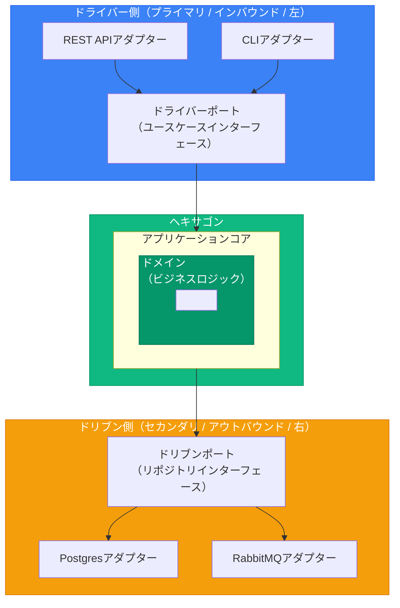
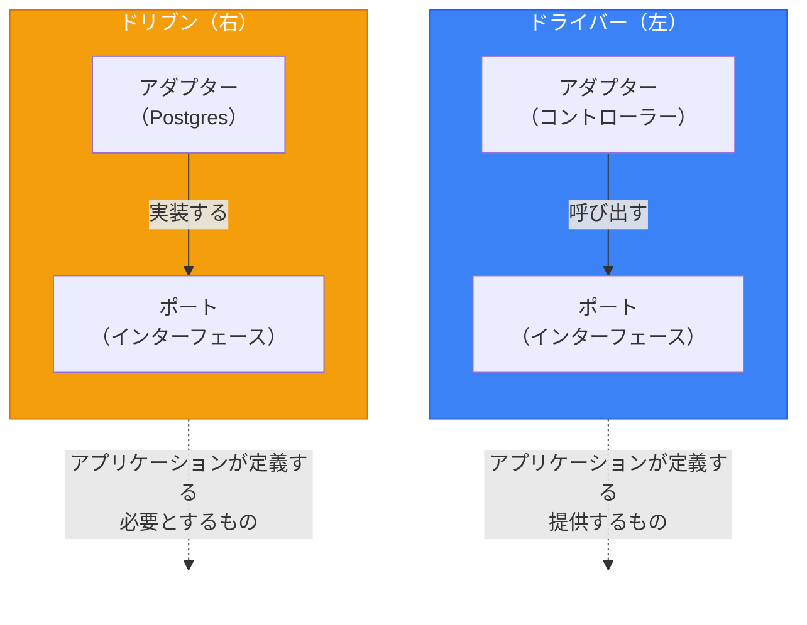

# ヘキサゴナルアーキテクチャ（ポート＆アダプター）

> 出典:
> - [Hexagonal Architecture](https://alistair.cockburn.us/hexagonal-architecture/) — Alistair Cockburn (2005)
> - [Hexagonal Architecture Explained](https://openlibrary.org/works/OL38388131W) — Alistair Cockburn & Juan Manuel Garrido de Paz (2024)
> - [Interview with Alistair Cockburn](https://jmgarridopaz.github.io/content/interviewalistair.html) — Juan Manuel Garrido de Paz
> - [Hexagonal Architecture Pattern](https://docs.aws.amazon.com/prescriptive-guidance/latest/cloud-design-patterns/hexagonal-architecture.html) — AWS

## コアコンセプト

> 「アプリケーションが、ユーザー、プログラム、自動テスト、バッチスクリプトのいずれからも等しく駆動でき、最終的な実行時デバイスやデータベースから分離して開発・テストできるようにする。」
> — Alistair Cockburn

**設計検証テクニック:** このパターンはFITテストを念頭に設計された — ビジネスエキスパートがGUIなしでテストケースを書ける。テストフィクスチャからアプリケーション全体を実行できれば、ヘキサゴナル境界は正しい。

**ヘキサゴンは概念的。** ほとんどのアプリケーションは2-4個のポートを持ち、6個ではない。この形は、方向に関係なく全ての外部インタラクションがポートを通ることを強調する。



---

## ポート

アプリケーションが外部世界とどう通信するかを定義するインターフェース。

### ドライバーポート（プライマリ / インバウンド）

**世界があなたのアプリケーションをどう使うか**を定義。

- アプリケーションへのエントリポイント
- アダプターから呼び出される
- ユースケースを表現

```typescript
// application/ports/driver/place_order_port.ts
export interface IPlaceOrderPort {
  execute(command: PlaceOrderCommand): Promise<OrderId>;
}

// application/ports/driver/get_order_port.ts
export interface IGetOrderPort {
  execute(query: GetOrderQuery): Promise<OrderDTO | null>;
}

// application/ports/driver/cancel_order_port.ts
export interface ICancelOrderPort {
  execute(command: CancelOrderCommand): Promise<void>;
}
```

### ドリブンポート（セカンダリ / アウトバウンド）

**あなたのアプリケーションが外部システムをどう使うか**を定義。

- アプリケーションが必要とする依存
- アダプターが実装
- アプリケーションがこれらのインターフェースを呼び出す

```typescript
// application/ports/driven/order_repository_port.ts
export interface IOrderRepositoryPort {
  findById(id: OrderId): Promise<Order | null>;
  save(order: Order): Promise<void>;
  delete(order: Order): Promise<void>;
}

// application/ports/driven/event_publisher_port.ts
export interface IEventPublisherPort {
  publish(event: DomainEvent): Promise<void>;
  publishAll(events: DomainEvent[]): Promise<void>;
}

// application/ports/driven/payment_gateway_port.ts
export interface IPaymentGatewayPort {
  charge(amount: Money, paymentMethod: PaymentMethod): Promise<PaymentResult>;
  refund(paymentId: PaymentId, amount: Money): Promise<RefundResult>;
}

// application/ports/driven/notification_port.ts
export interface INotificationPort {
  sendEmail(to: Email, template: EmailTemplate): Promise<void>;
  sendSMS(to: PhoneNumber, message: string): Promise<void>;
}
```

---

## アダプター

ポートを外部技術に接続する具象実装。

### ドライバーアダプター（プライマリ / インバウンド）

外部入力をポート呼び出しに変換。

```typescript
// infrastructure/adapters/driver/rest/order_controller.ts
import { Router, Request, Response } from 'express';
import { IPlaceOrderPort } from '@/application/ports/driver/place_order_port';
import { IGetOrderPort } from '@/application/ports/driver/get_order_port';

export class OrderController {
  constructor(
    private readonly placeOrder: IPlaceOrderPort,
    private readonly getOrder: IGetOrderPort,
  ) {}

  async create(req: Request, res: Response): Promise<void> {
    const command: PlaceOrderCommand = {
      customerId: req.user.id,
      items: req.body.items.map((item: any) => ({
        productId: item.product_id,
        quantity: item.quantity,
      })),
    };

    const orderId = await this.placeOrder.execute(command);
    res.status(201).json({ id: orderId.value });
  }

  async show(req: Request, res: Response): Promise<void> {
    const order = await this.getOrder.execute({ orderId: req.params.id });

    if (!order) {
      res.status(404).json({ error: 'Order not found' });
      return;
    }

    res.json(order);
  }
}
```

### ドリブンアダプター（セカンダリ / アウトバウンド）

特定の技術を使ってポートインターフェースを実装。

```
class PostgresOrderRepository implements IOrderRepositoryPort:
    db: Database

    findById(id: OrderId) -> Order | null:
        row = db.orders.where(id: id.value).first()
        if not row:
            return null
        return OrderMapper.toDomain(row)

    save(order: Order):
        data = OrderMapper.toPersistence(order)
        db.orders.upsert(data)

    delete(order: Order):
        db.orders.where(id: order.id.value).delete()
```

**インメモリ（テスト用）:**

```
class InMemoryOrderRepository implements IOrderRepositoryPort:
    orders: Map<string, Order> = {}

    findById(id: OrderId) -> Order | null:
        return orders.get(id.value) or null

    save(order: Order):
        orders.set(order.id.value, order)

    delete(order: Order):
        orders.delete(order.id.value)

    clear():
        orders.clear()
```

---

## 命名規則

### Alistair Cockburn推奨パターン

**ポート:** `For[Doing][Something]`
- ドライバー: `ForPlacingOrders`, `ForConfiguringSettings`
- ドリブン: `ForStoringUsers`, `ForNotifyingAlerts`

**アダプター:** 技術を参照
- `CliCommandForPlacingOrders`
- `MysqlDatabaseForStoringUsers`
- `SlackNotifierForAlerts`

### 代替パターン

| パターン | ポート | アダプター |
|---------|------|-----------|
| Interface/Impl | `IOrderRepository` | `PostgresOrderRepository` |
| Portサフィックス | `OrderRepositoryPort` | `PostgresOrderAdapter` |
| Usingプレフィックス | `IOrderStorage` | `OrderStorageUsingPostgres` |

### プロジェクト構成

```
src/
├── application/
│   ├── ports/
│   │   ├── driver/                    # インバウンドポート
│   │   │   ├── place_order_port.ts
│   │   │   ├── get_order_port.ts
│   │   │   └── cancel_order_port.ts
│   │   └── driven/                    # アウトバウンドポート
│   │       ├── order_repository_port.ts
│   │       ├── event_publisher_port.ts
│   │       └── payment_gateway_port.ts
│   └── use_cases/
│       ├── place_order/
│       │   └── handler.ts             # ドライバーポートを実装
│       └── get_order/
│           └── handler.ts
├── infrastructure/
│   └── adapters/
│       ├── driver/                    # インバウンドアダプター
│       │   ├── rest/
│       │   │   └── order_controller.ts
│       │   ├── grpc/
│       │   │   └── order_service.ts
│       │   └── cli/
│       │       └── commands.ts
│       └── driven/                    # アウトバウンドアダプター
│           ├── postgres/
│           │   └── order_repository.ts
│           ├── rabbitmq/
│           │   └── event_publisher.ts
│           ├── stripe/
│           │   └── payment_gateway.ts
│           └── in_memory/             # テストアダプター
│               ├── order_repository.ts
│               └── event_publisher.ts
└── domain/
    └── ...
```

---

## 主要な非対称性



---

## アダプターによる構成可能性

ヘキサゴナルアーキテクチャの力: コアを変更せずにアダプターを交換。

```typescript
// infrastructure/config/container.ts

function configureDevelopment(container: Container): void {
  container.bind<IOrderRepositoryPort>('IOrderRepositoryPort')
    .to(InMemoryOrderRepository);
  container.bind<IEventPublisherPort>('IEventPublisherPort')
    .to(InMemoryEventPublisher);
  container.bind<IPaymentGatewayPort>('IPaymentGatewayPort')
    .to(FakePaymentGateway);
}

function configureTest(container: Container): void {
  container.bind<IOrderRepositoryPort>('IOrderRepositoryPort')
    .to(InMemoryOrderRepository);
  container.bind<IEventPublisherPort>('IEventPublisherPort')
    .to(SpyEventPublisher);
  container.bind<IPaymentGatewayPort>('IPaymentGatewayPort')
    .to(MockPaymentGateway);
}

function configureProduction(container: Container): void {
  container.bind<IOrderRepositoryPort>('IOrderRepositoryPort')
    .to(PostgresOrderRepository);
  container.bind<IEventPublisherPort>('IEventPublisherPort')
    .to(RabbitMQEventPublisher);
  container.bind<IPaymentGatewayPort>('IPaymentGatewayPort')
    .to(StripePaymentGateway);
}
```

---

## 強い実装 vs 弱い実装

### 弱い実装

ポートが技術を意識している（真に抽象的でない）:

```typescript
// ❌ 弱い: SQLの概念が漏洩
interface IOrderRepository {
  findByQuery(sql: string, params: any[]): Promise<Order[]>;
}
```

### 強い実装

ポートが完全に技術非依存:

```typescript
// ✅ 強い: 純粋なドメイン概念
interface IOrderRepository {
  findById(id: OrderId): Promise<Order | null>;
  findByCustomer(customerId: CustomerId): Promise<Order[]>;
  save(order: Order): Promise<void>;
}
```

---

## メリット

1. **テスト容易性** - 実アダプターをテストダブルに交換
2. **柔軟性** - コアを変更せずに技術を変更
3. **独立性** - 外部システムなしでコアを開発
4. **明確な境界** - レイヤー間の明示的なインターフェース
5. **並列開発** - チームが異なるアダプターで作業可能
