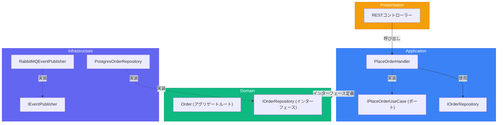

# レイヤー構造 - 完全リファレンス

> 出典:
> - [The Clean Architecture](https://blog.cleancoder.com/uncle-bob/2012/08/13/the-clean-architecture.html) — Robert C. Martin
> - [Designing a DDD-oriented Microservice](https://learn.microsoft.com/en-us/dotnet/architecture/microservices/microservice-ddd-cqrs-patterns/ddd-oriented-microservice) — Microsoft
> - [Clean Architecture: Standing on the Shoulders of Giants](https://herbertograca.com/2017/09/28/clean-architecture-standing-on-the-shoulders-of-giants/) — Herberto Graça

## 4つのレイヤー

| レイヤー | 責務 | 依存先 |
|---------|------|--------|
| **Domain** | ビジネスロジック、エンティティ、ルール | なし（純粋） |
| **Application** | ユースケース、オーケストレーション | Domain |
| **Infrastructure** | 外部システム、フレームワーク | Application, Domain |
| **Presentation** | API/UIエントリポイント | Application |

---

## Domainレイヤー（最内層）

システムの**心臓部**。ビジネスロジックとルールを含み、**外部依存ゼロ**。

### 構成

```
domain/
├── order/                      # アグリゲートフォルダ
│   ├── order.ts                # アグリゲートルートエンティティ
│   ├── order_item.ts           # 子エンティティ
│   ├── value_objects.ts        # Money, Address, OrderStatus
│   ├── events.ts               # OrderPlaced, OrderShipped
│   ├── repository.ts           # IOrderRepository インターフェース
│   ├── services.ts             # PricingService, DiscountService
│   └── errors.ts               # InsufficientStockError
├── customer/
│   └── ...
├── product/
│   └── ...
└── shared/
    ├── entity.ts               # 基底Entityクラス
    ├── aggregate_root.ts       # 基底AggregateRootクラス
    ├── value_object.ts         # 基底ValueObjectクラス
    ├── domain_event.ts         # 基底DomainEventクラス
    └── errors.ts               # DomainError基底
```

### ルール

1. **フレームワークインポート禁止** - ORMデコレータ、HTTPライブラリなし
2. **インフラ関心事禁止** - データベース、メッセージキューなし
3. **純粋なビジネスロジック** - 言語プリミティブとドメイン型のみ
4. **豊かな振る舞い** - ビジネスルールを強制するメソッド

### 例: ドメインエンティティ

```typescript
// domain/order/order.ts
import { AggregateRoot } from '../shared/aggregate_root';
import { OrderItem } from './order_item';
import { Money } from './value_objects';
import { OrderPlaced, OrderShipped } from './events';
import { InsufficientStockError } from './errors';

export class Order extends AggregateRoot<OrderId> {
  private items: OrderItem[] = [];
  private status: OrderStatus;

  private constructor(id: OrderId, customerId: CustomerId) {
    super(id);
    this.customerId = customerId;
    this.status = OrderStatus.Draft;
  }

  static create(id: OrderId, customerId: CustomerId): Order {
    const order = new Order(id, customerId);
    order.addDomainEvent(new OrderPlaced(id, customerId));
    return order;
  }

  addItem(product: Product, quantity: number): void {
    if (quantity <= 0) {
      throw new InvalidQuantityError(quantity);
    }
    if (!product.hasStock(quantity)) {
      throw new InsufficientStockError(product.id, quantity);
    }

    const existingItem = this.items.find(i => i.productId.equals(product.id));
    if (existingItem) {
      existingItem.increaseQuantity(quantity);
    } else {
      this.items.push(OrderItem.create(product.id, product.price, quantity));
    }
  }

  ship(): void {
    if (this.status !== OrderStatus.Confirmed) {
      throw new InvalidOrderStateError('Cannot ship unconfirmed order');
    }
    this.status = OrderStatus.Shipped;
    this.addDomainEvent(new OrderShipped(this.id));
  }

  get total(): Money {
    return this.items.reduce(
      (sum, item) => sum.add(item.subtotal),
      Money.zero()
    );
  }
}
```

---

## Applicationレイヤー

ドメインオブジェクトを調整してユースケースをオーケストレーション。**アプリケーション固有のビジネスルール**を含む。

### 構成

```
application/
├── orders/
│   ├── place_order/
│   │   ├── command.ts          # PlaceOrderCommand DTO
│   │   ├── handler.ts          # PlaceOrderHandler
│   │   └── port.ts             # IPlaceOrderUseCase インターフェース
│   ├── ship_order/
│   │   └── ...
│   └── get_order/
│       ├── query.ts            # GetOrderQuery DTO
│       ├── handler.ts          # GetOrderHandler
│       └── result.ts           # OrderDTO レスポンス
├── shared/
│   ├── unit_of_work.ts         # IUnitOfWork インターフェース
│   ├── event_publisher.ts      # IEventPublisher インターフェース
│   └── errors.ts               # ApplicationError基底
└── index.ts                    # パブリックAPIエクスポート
```

### ルール

1. **Domainにのみ依存** - インフラのインポート禁止
2. **ポートを定義** - リポジトリ、外部サービスのインターフェース
3. **オーケストレーションのみ、実装しない** - ドメインメソッドを呼び出す
4. **トランザクション境界** - Unit of Workを管理

### 例: ユースケースハンドラー

```typescript
// application/orders/place_order/handler.ts
import { Order } from '@/domain/order/order';
import { IOrderRepository } from '@/domain/order/repository';
import { IProductRepository } from '@/domain/product/repository';
import { IUnitOfWork } from '@/application/shared/unit_of_work';
import { IEventPublisher } from '@/application/shared/event_publisher';
import { PlaceOrderCommand } from './command';
import { OrderNotFoundError, ProductNotFoundError } from '@/application/shared/errors';

export interface IPlaceOrderUseCase {
  execute(command: PlaceOrderCommand): Promise<OrderId>;
}

export class PlaceOrderHandler implements IPlaceOrderUseCase {
  constructor(
    private readonly orderRepo: IOrderRepository,
    private readonly productRepo: IProductRepository,
    private readonly uow: IUnitOfWork,
    private readonly eventPublisher: IEventPublisher,
  ) {}

  async execute(command: PlaceOrderCommand): Promise<OrderId> {
    await this.uow.begin();

    try {
      const orderId = OrderId.generate();
      const order = Order.create(orderId, command.customerId);

      for (const item of command.items) {
        const product = await this.productRepo.findById(item.productId);
        if (!product) {
          throw new ProductNotFoundError(item.productId);
        }
        order.addItem(product, item.quantity);
      }

      await this.orderRepo.save(order);
      await this.uow.commit();
      await this.eventPublisher.publishAll(order.domainEvents);

      return orderId;
    } catch (error) {
      await this.uow.rollback();
      throw error;
    }
  }
}
```

### コマンド/クエリDTO

```typescript
// application/orders/place_order/command.ts
export interface PlaceOrderCommand {
  customerId: string;
  items: Array<{
    productId: string;
    quantity: number;
  }>;
}

// application/orders/get_order/query.ts
export interface GetOrderQuery {
  orderId: string;
}

// application/orders/get_order/result.ts
export interface OrderDTO {
  id: string;
  customerId: string;
  status: string;
  items: Array<{
    productId: string;
    productName: string;
    quantity: number;
    unitPrice: number;
    subtotal: number;
  }>;
  total: number;
  createdAt: string;
}
```

---

## Infrastructureレイヤー

DomainとApplicationレイヤーで定義されたインターフェースを実装。**全ての外部関心事**を含む。

### 構成

```
infrastructure/
├── persistence/
│   ├── postgres/
│   │   ├── order_repository.ts      # PostgresOrderRepository
│   │   ├── product_repository.ts
│   │   ├── unit_of_work.ts          # PostgresUnitOfWork
│   │   ├── migrations/
│   │   └── mappers/
│   │       └── order_mapper.ts      # Domain <-> DBマッピング
│   └── in_memory/
│       ├── order_repository.ts      # InMemoryOrderRepository（テスト用）
│       └── unit_of_work.ts
├── messaging/
│   ├── rabbitmq/
│   │   └── event_publisher.ts       # RabbitMQEventPublisher
│   └── in_memory/
│       └── event_publisher.ts       # InMemoryEventPublisher（テスト用）
├── external/
│   ├── payment/
│   │   └── stripe_gateway.ts        # StripePaymentGateway
│   └── shipping/
│       └── fedex_service.ts         # FedExShippingService
├── http/
│   ├── rest/
│   │   ├── controllers/
│   │   │   └── order_controller.ts  # REST APIアダプター
│   │   ├── middleware/
│   │   └── routes.ts
│   └── graphql/
│       └── resolvers/
├── grpc/
│   └── order_service.ts             # gRPCアダプター
└── config/
    ├── container.ts                 # DIコンテナセットアップ
    └── env.ts                       # 環境設定
```

### ルール

1. **ポートを実装** - インターフェースの具象クラス
2. **フレームワークコードを含む** - ORM、HTTPフレームワーク等
3. **レイヤー間のマッピング** - Domain ↔ Database/DTOマッピング
4. **容易に交換可能** - PostgresをMongoDBに交換可能

### 例: リポジトリ実装

```
class PostgresOrderRepository implements IOrderRepository:
    db: Database

    findById(id: OrderId) -> Order | null:
        row = db.orders
            .where(id: id.value)
            .withRelated("items")
            .first()

        if not row:
            return null

        return OrderMapper.toDomain(row)

    save(order: Order):
        data = OrderMapper.toPersistence(order)
        db.orders.upsert(data)

    delete(order: Order):
        db.orders.where(id: order.id.value).delete()
```

---

## Presentationレイヤー

アプリケーションへのエントリポイント。外部リクエストをアプリケーションのコマンド/クエリに変換。

### 構成

```
presentation/
├── rest/
│   ├── controllers/
│   │   ├── order_controller.ts
│   │   └── product_controller.ts
│   ├── middleware/
│   │   ├── auth.ts
│   │   ├── error_handler.ts
│   │   └── validation.ts
│   ├── dto/
│   │   ├── requests/
│   │   └── responses/
│   └── routes.ts
├── grpc/
│   └── ...
├── graphql/
│   └── ...
└── cli/
    └── ...
```

### 例: RESTコントローラー

```typescript
// presentation/rest/controllers/order_controller.ts
import { Request, Response, NextFunction } from 'express';
import { IPlaceOrderUseCase } from '@/application/orders/place_order/port';
import { IGetOrderUseCase } from '@/application/orders/get_order/port';
import { PlaceOrderRequest } from '../dto/requests/place_order_request';

export class OrderController {
  constructor(
    private readonly placeOrder: IPlaceOrderUseCase,
    private readonly getOrder: IGetOrderUseCase,
  ) {}

  async create(req: Request, res: Response, next: NextFunction): Promise<void> {
    try {
      const request = req.body as PlaceOrderRequest;

      const orderId = await this.placeOrder.execute({
        customerId: req.user.id,
        items: request.items.map(item => ({
          productId: item.product_id,
          quantity: item.quantity,
        })),
      });

      res.status(201).json({ id: orderId.value });
    } catch (error) {
      next(error);
    }
  }

  async show(req: Request, res: Response, next: NextFunction): Promise<void> {
    try {
      const order = await this.getOrder.execute({ orderId: req.params.id });

      if (!order) {
        res.status(404).json({ error: 'Order not found' });
        return;
      }

      res.json(order);
    } catch (error) {
      next(error);
    }
  }
}
```

---

## 依存フロー



---

## コンポジションルート

全ての依存関係はアプリケーションのエントリポイントで結合される。

```typescript
import { Pool } from 'pg';
import { Container } from 'inversify';
import { IOrderRepository } from '@/domain/order/repository';
import { IProductRepository } from '@/domain/product/repository';
import { IPlaceOrderUseCase } from '@/application/orders/place_order/port';
import { IUnitOfWork } from '@/application/shared/unit_of_work';
import { IEventPublisher } from '@/application/shared/event_publisher';
import { PlaceOrderHandler } from '@/application/orders/place_order/handler';
import { PostgresOrderRepository } from '@/infrastructure/persistence/postgres/order_repository';
import { PostgresProductRepository } from '@/infrastructure/persistence/postgres/product_repository';
import { PostgresUnitOfWork } from '@/infrastructure/persistence/postgres/unit_of_work';
import { RabbitMQEventPublisher } from '@/infrastructure/messaging/rabbitmq/event_publisher';
import { OrderController } from '@/presentation/rest/controllers/order_controller';

export function configureContainer(): Container {
  const container = new Container();
  const pool = new Pool({ connectionString: process.env.DATABASE_URL });

  container.bind<Pool>('Pool').toConstantValue(pool);
  container.bind<IOrderRepository>('IOrderRepository').to(PostgresOrderRepository);
  container.bind<IProductRepository>('IProductRepository').to(PostgresProductRepository);
  container.bind<IUnitOfWork>('IUnitOfWork').to(PostgresUnitOfWork);
  container.bind<IEventPublisher>('IEventPublisher').to(RabbitMQEventPublisher);
  container.bind<IPlaceOrderUseCase>('IPlaceOrderUseCase').to(PlaceOrderHandler);
  container.bind<OrderController>(OrderController).toSelf();

  return container;
}
```

---

## 言語非依存の構造

同じレイヤー構造はどの言語にも適用可能:

### Go
```
internal/
├── domain/
├── application/
├── infrastructure/
└── interfaces/      # Presentation
```

### Rust
```
src/
├── domain/
├── application/
├── infrastructure/
└── presentation/
```

### Python
```
src/
├── domain/
├── application/
├── infrastructure/
└── presentation/
```

鍵は**依存の方向**: 外側のレイヤーが内側をインポートし、逆は絶対にない。
