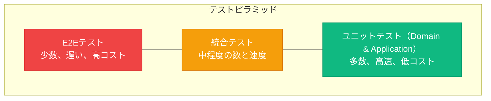

# テストパターン

> 出典:
> - [The Clean Architecture](https://blog.cleancoder.com/uncle-bob/2012/08/13/the-clean-architecture.html) — Robert C. Martin
> - [Hexagonal Architecture](https://alistair.cockburn.us/hexagonal-architecture/) — Alistair Cockburn
> - [Unit Testing](https://martinfowler.com/bliki/UnitTest.html) — Martin Fowler
> - [Test Pyramid](https://martinfowler.com/bliki/TestPyramid.html) — Martin Fowler

Clean Architecture + DDD + Hexagonalシステムのテスト戦略。

## テストピラミッド



---

## ユニットテスト

### Domainレイヤーテスト

ビジネスロジックを分離してテスト。**モック不要** — ドメインは依存を持たない。

```typescript
describe('Order', () => {
  describe('create', () => {
    it('ドラフト状態で注文を作成', () => {
      const order = Order.create(CustomerId.from('cust-123'));
      expect(order.status).toBe(OrderStatus.Draft);
      expect(order.items).toHaveLength(0);
    });

    it('OrderCreatedイベントを発行', () => {
      const order = Order.create(CustomerId.from('cust-123'));
      expect(order.domainEvents).toHaveLength(1);
      expect(order.domainEvents[0]).toBeInstanceOf(OrderCreated);
    });
  });

  describe('addItem', () => {
    it('注文にアイテムを追加', () => {
      const order = createDraftOrder();
      order.addItem(ProductId.from('prod-123'), Quantity.create(2), Money.create(10, 'USD'));
      expect(order.items).toHaveLength(1);
    });

    it('既存商品の数量を増加', () => {
      const order = createDraftOrder();
      const productId = ProductId.from('prod-123');
      const price = Money.create(10, 'USD');
      order.addItem(productId, Quantity.create(2), price);
      order.addItem(productId, Quantity.create(3), price);
      expect(order.items).toHaveLength(1);
      expect(order.items[0].quantity.value).toBe(5);
    });

    it('キャンセル済み注文でスロー', () => {
      const order = createCancelledOrder();
      expect(() => {
        order.addItem(ProductId.from('prod-123'), Quantity.create(1), Money.create(10, 'USD'));
      }).toThrow(InvalidOrderStateError);
    });
  });

  describe('confirm', () => {
    it('ステータスを確認済みに変更', () => {
      const order = createOrderWithItems();
      order.confirm();
      expect(order.status).toBe(OrderStatus.Confirmed);
    });

    it('空の注文でスロー', () => {
      const order = createDraftOrder();
      expect(() => order.confirm()).toThrow(EmptyOrderError);
    });
  });

  describe('total', () => {
    it('全アイテムから合計を計算', () => {
      const order = createDraftOrder();
      order.addItem(ProductId.from('p1'), Quantity.create(2), Money.create(10, 'USD'));
      order.addItem(ProductId.from('p2'), Quantity.create(1), Money.create(25, 'USD'));
      expect(order.total.amount).toBe(45); // 2*10 + 1*25
    });
  });
});
```

### 値オブジェクトテスト

```typescript
describe('Money', () => {
  it('有効な金額で作成', () => {
    const money = Money.create(10.50, 'USD');
    expect(money.amount).toBe(10.50);
  });

  it('負の金額でスロー', () => {
    expect(() => Money.create(-1, 'USD')).toThrow(InvalidMoneyError);
  });

  it('同一通貨の加算', () => {
    const result = Money.create(10, 'USD').add(Money.create(20, 'USD'));
    expect(result.amount).toBe(30);
  });

  it('異なる通貨でスロー', () => {
    expect(() => Money.create(10, 'USD').add(Money.create(10, 'EUR'))).toThrow(CurrencyMismatchError);
  });

  it('同じ金額と通貨で等価', () => {
    expect(Money.create(10, 'USD').equals(Money.create(10, 'USD'))).toBe(true);
  });
});
```

### Applicationレイヤーテスト

モック化されたポートでユースケースをテスト。

```typescript
describe('PlaceOrderHandler', () => {
  let handler: PlaceOrderHandler;
  let orderRepo: MockOrderRepository;
  let productRepo: MockProductRepository;
  let eventPublisher: MockEventPublisher;

  beforeEach(() => {
    orderRepo = new MockOrderRepository();
    productRepo = new MockProductRepository();
    eventPublisher = new MockEventPublisher();
    handler = new PlaceOrderHandler(orderRepo, productRepo, eventPublisher);
  });

  it('アイテム付き注文を作成して保存', async () => {
    productRepo.addProduct(createTestProduct('prod-1', 10.00));
    const command: PlaceOrderCommand = {
      customerId: 'cust-123',
      items: [{ productId: 'prod-1', quantity: 2 }],
    };

    const orderId = await handler.handle(command);

    const saved = await orderRepo.findById(OrderId.from(orderId));
    expect(saved).not.toBeNull();
    expect(saved!.items).toHaveLength(1);
  });

  it('ドメインイベントを発行', async () => {
    productRepo.addProduct(createTestProduct('prod-1', 10.00));
    await handler.handle({ customerId: 'cust-123', items: [{ productId: 'prod-1', quantity: 1 }] });
    expect(eventPublisher.publishedEvents[0]).toBeInstanceOf(OrderCreated);
  });

  it('商品が見つからない場合スロー', async () => {
    const command = { customerId: 'cust-123', items: [{ productId: 'nonexistent', quantity: 1 }] };
    await expect(handler.handle(command)).rejects.toThrow(ProductNotFoundError);
  });
});
```

---

## 統合テスト

実際のインフラ（データベース、メッセージブローカー）でアダプターをテスト。

```typescript
describe('PostgresOrderRepository', () => {
  let pool: Pool;
  let repository: PostgresOrderRepository;

  beforeAll(async () => {
    pool = new Pool({ connectionString: process.env.TEST_DATABASE_URL });
    repository = new PostgresOrderRepository(pool);
  });

  beforeEach(async () => {
    await pool.query('TRUNCATE orders, order_items CASCADE');
  });

  afterAll(async () => { await pool.end(); });

  it('注文を永続化して取得', async () => {
    const order = Order.create(CustomerId.from('cust-123'));
    order.addItem(ProductId.from('prod-1'), Quantity.create(2), Money.create(10, 'USD'));

    await repository.save(order);
    const retrieved = await repository.findById(order.id);

    expect(retrieved).not.toBeNull();
    expect(retrieved!.items).toHaveLength(1);
  });

  it('存在しない注文でnullを返す', async () => {
    const result = await repository.findById(OrderId.from('nonexistent'));
    expect(result).toBeNull();
  });
});
```

### API統合テスト

```typescript
describe('Orders API', () => {
  describe('POST /orders', () => {
    it('注文を作成して201を返す', async () => {
      const response = await request(app)
        .post('/orders')
        .send({ customer_id: 'cust-123', items: [{ product_id: 'prod-1', quantity: 2 }] });
      expect(response.status).toBe(201);
      expect(response.body.id).toBeDefined();
    });

    it('無効な商品で400を返す', async () => {
      const response = await request(app)
        .post('/orders')
        .send({ customer_id: 'cust-123', items: [{ product_id: 'nonexistent', quantity: 1 }] });
      expect(response.status).toBe(400);
    });
  });
});
```

---

## アーキテクチャテスト

アーキテクチャルールが守られていることを検証。

```typescript
describe('アーキテクチャ', () => {
  it('ドメインはアプリケーションに依存しない', async () => {
    const rule = filesOfProject()
      .inFolder('domain')
      .shouldNot()
      .dependOnFiles()
      .inFolder('application');
    await expect(rule).toPassAsync();
  });

  it('ドメインはインフラに依存しない', async () => {
    const rule = filesOfProject()
      .inFolder('domain')
      .shouldNot()
      .dependOnFiles()
      .inFolder('infrastructure');
    await expect(rule).toPassAsync();
  });

  it('アプリケーションはインフラに依存しない', async () => {
    const rule = filesOfProject()
      .inFolder('application')
      .shouldNot()
      .dependOnFiles()
      .inFolder('infrastructure');
    await expect(rule).toPassAsync();
  });
});
```

---

## テスト構成

```
tests/
├── unit/
│   ├── domain/           # ドメインロジック（モック不要）
│   └── application/      # ユースケース（ポートをモック）
├── integration/
│   ├── persistence/      # DB操作
│   ├── messaging/        # メッセージブローカー
│   └── http/             # APIエンドポイント
├── e2e/                  # エンドツーエンドフロー
├── architecture/         # 依存ルール検証
├── fixtures/             # テストデータビルダー
└── helpers/              # テストユーティリティ
```

---

## テストフィクスチャ＆ビルダー

```typescript
export class OrderBuilder {
  private customerId = CustomerId.from('default-customer');
  private items: Array<{ productId: ProductId; quantity: Quantity; price: Money }> = [];
  private status: 'draft' | 'confirmed' = 'draft';

  withCustomer(id: string): this { this.customerId = CustomerId.from(id); return this; }
  withItem(productId: string, quantity: number, price: number): this {
    this.items.push({ productId: ProductId.from(productId), quantity: Quantity.create(quantity), price: Money.create(price, 'USD') });
    return this;
  }
  confirmed(): this { this.status = 'confirmed'; return this; }

  build(): Order {
    const order = Order.create(this.customerId);
    for (const item of this.items) order.addItem(item.productId, item.quantity, item.price);
    if (this.status === 'confirmed') { order.setShippingAddress(new AddressBuilder().build()); order.confirm(); }
    order.clearEvents();
    return order;
  }
}
```

---

## 主要テスト原則

1. **実装ではなく振る舞いをテスト** - 「何を」に注目、「どう」ではない
2. **ドメインテストにモック不要** - ドメインレイヤーは純粋
3. **ポート境界でモック** - Applicationテストはドリブンポートをモック
4. **統合テストは実インフラを使用** - 実際のDB、メッセージブローカーでテスト
5. **高速なユニットテスト、遅い統合テスト** - ユニットテストを頻繁に実行
6. **ビジネスルールはドメインでテスト** - ApplicationやInfrastructureではなく
